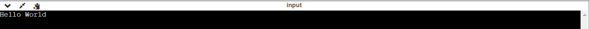

## Aim of the Program

A C program that contains a string (char pointer) with a value ‘Hello world’. The
program should XOR each character in this string with 0 and displays the result.

### Output

## Aim of the Program
Write a C program that contains a string (char pointer) with a value ‘Hello world’. The
program should AND or and XOR each character in this string with 127 and display the
result.

### Output

